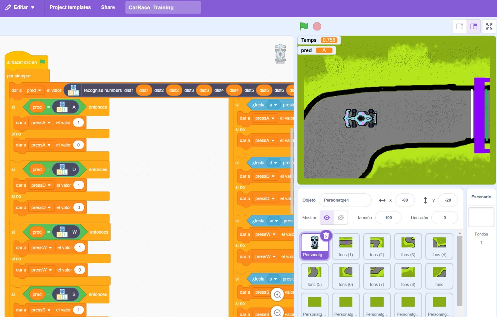
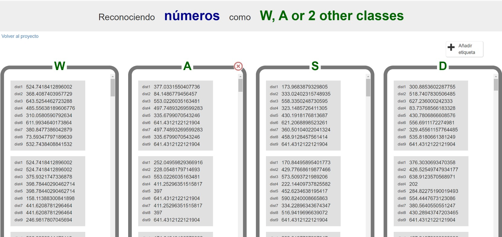
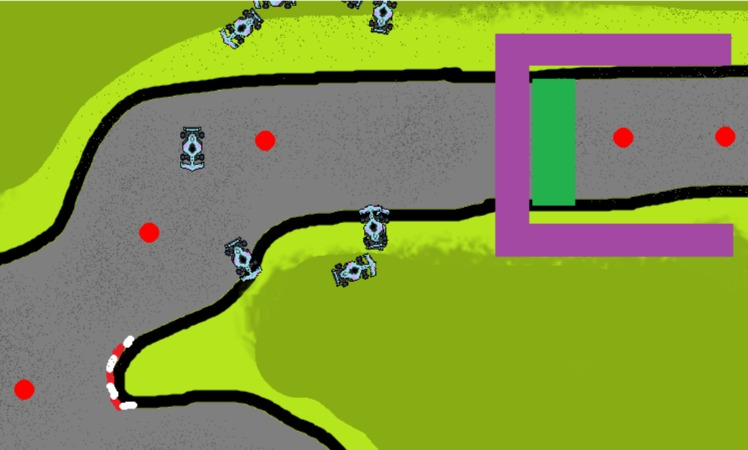

# Car conduction learning
> In this repo, there's two simple implementations of a way to teach a machine to drive a car around a track. This work was done in the context of a Codelearn summer camp with kids aged 9-14.

## Table of Contents

- [Car conduction learning](#car-conduction-learning)
  - [Table of Contents](#table-of-contents)
  - [File structure](#file-structure)
    - [Python Files](#python-files)
    - [Scratch Files](#scratch-files)
  - [Scratch implementation](#scratch-implementation)
  - [Python implementation](#python-implementation)

## File structure

    │  .gitignore
    ├─  README.md
    │
    ├───Assets (images)
    │
    ├───Checkpoints
    │
    ├───Python
    │ │ car_class.py
    │ │ config-feedforward.txt
    │ │ constants.py
    │ │ initial_game.py
    │ │ neat-game.py
    │ │
    │ └───pycache
    │
    └───Scratch
      │ CarRace_Buit.sb3
      │ CarRace_Final.sb3
      │ CarRace_Playable.sb3
      └ CarRace_Training.sb3

### Python Files

- **car_class.py**: Contains the car class definition for the game.
- **config-feedforward.txt**: Configuration file for the feedforward neural network, as defined using NEAT.
- **constants.py**: Contains constants used by Pygame.
- **initial_game.py**: Initial playable game.
- **neat-game.py**: Main file to run the game using NEAT.

### Scratch Files

- **CarRace_Buit.sb3**: Initial build of the car race game.
- **CarRace_Final.sb3**: Final version of the car race game.
- **CarRace_Playable.sb3**: Playable version of the car race game.
- **CarRace_Training.sb3**: Training version of the car race game.

## Scratch implementation

The scratch folder contains various stages of the Scratch code created. Buit is the initial game (background and sprites), and Playable is the one that can be played using the default Scratch web (or app).

For the others, you need to open them using the web [Machine Learning for kids](https://machinelearningforkids.co.uk/). The model that need to be created is a **Recognizing numbers** model, with 9 inputs and 4 outputs (W,A,S,D).

  

You don't need to enter training data: you create the model with the outputs defined, load the Training file, and complete 3 or 4 laps around the track (it collects your data). After that, you can go into the web, train the model, and use the Final file to view of does it do the circuit.

  

## Python implementation

The initial Python implementation of the game can be found in 'initial game.py'. It uses the library pygame, so that's a requirement.

The other file, neat game, uses the 'neat-python' library, that can be found [here](https://neat-python.readthedocs.io/en/latest/).

With this library, we can easily define a neural evolutionary algorithm that uses a simple feedforward network to control the car (it controls the steer). Some rewards have also been added to the track to guide the car.

  

The results aren't great: the cars don't seem to learn a lot, they usually go out of bounds... Hovewer, it was a great way to show more or less of evolutionary algorithms and reinforcement could be used to teach a machine to play a game (without previous knowledge, unlike in the Scratch implementation where it tries to imitate the human)
